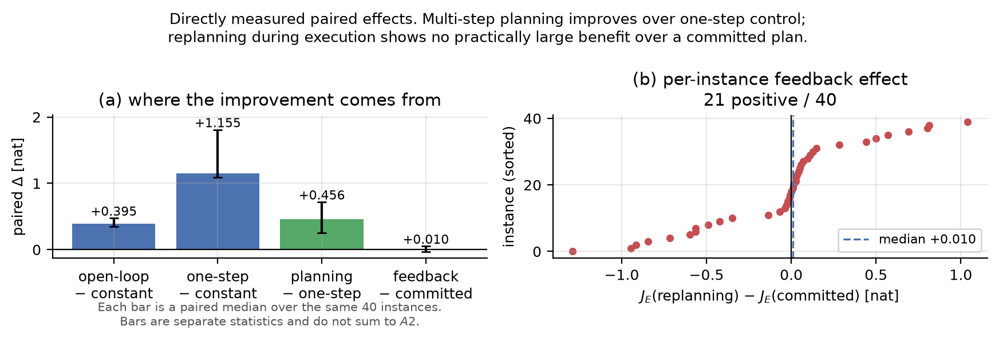

# When Does Feedback Help?

### Planning and Model Mismatch in Hessian-Free Newton Control

This repository contains the code, the row-level results, and the manuscript source for
a study of how much benefit comes from **planning** versus **execution-time feedback**
when a controller allocates damping and conjugate-gradient effort inside Hessian-free
Newton--CG.

> **Status.** Unrefereed technical report by an undergraduate, released as a
> self-contained artifact. It is **not peer reviewed, not published, and not available
> from any preprint server.** Read it as an engineering and measurement exercise whose
> claims you can check yourself, not as a validated contribution to the literature.
> AI assistants were used throughout, including in drafting the manuscript — see
> [AI-assisted research disclosure](#ai-assisted-research-disclosure) for what was
> delegated and what was not.

The part worth your attention is not the effect size. It is that every number here is
recomputable from published row-level data in a few minutes, every claim is registered
against its evidence, and the places where the study fell short are written down rather
than smoothed over. Twelve protocol deviations are recorded, one of which is a
correction to an earlier revision of the deviation record.

---

## The question

Truncated-Newton performance depends heavily on two computational-resource decisions:
the damping level and the per-step CG iteration budget. Adapting them during
optimization looks like a reinforcement learning problem. But before training a policy,
one should ask where the benefit would actually come from.

|  | Question |
|---|---|
| **Q1** | Does a good action *sequence* exist? |
| **Q2** | Is it worth *revising* that sequence with feedback during execution? |

These imply different artifacts. If only **Q1** holds, what is needed is a predictor
that fixes a schedule at the initial state. Only if **Q2** holds is a per-step feedback
policy justified.

To separate them we compare a ladder of controllers at an identical budget of
150 gradient-equivalent units (GE):

```
tuned constant  →  open-loop schedule  →  one-step greedy  →  committed plan  →  replanning
```

`committed` forms one plan at the initial state and executes it unchanged.
`shrinking` replans at every step. Both see the same instances and the same budget, so
the gap between them isolates the value of feedback.

## Three results

On 40 held-out instances of ill-conditioned SPD quadratics
(`d = 100`, `κ ∈ {1e3, 1e4, 1e5, 1e6}`, ten held-out seeds each):

1. **State-dependent control is where most of the gain is.** Moving from a tuned
   constant setting to one-step greedy control gives `+1.155 nat`
   (95% CI `+1.092` to `+1.811`, `p < 0.0001`, 40/40 instances).
2. **Multi-step planning adds a real but smaller increment.** `+0.456 nat`
   over one-step control (95% CI `+0.254` to `+0.720`, `p < 0.0001`, 35/40).
3. **Replanning during execution adds little here.** `+0.010 nat` over the committed
   plan (95% CI `−0.033` to `+0.053`, `p = 0.97`, 21/40). The interval is narrow and
   includes zero, and we did not observe a practically large feedback benefit.

In an exploratory extension we changed only the samples the optimizer observes, for the
same model and data. Under minibatch noise the committed plan became fragile: its step
rejection rate rose from `0.00` to `0.66`–`0.79` and its terminal improvement fell below
the tuned constant. Replanning reduced that loss — but it still did not consistently
beat inexpensive one-step control. Those runs use `n = 3` per regime, so we report signs
and directions, not magnitudes.

Policy learning (PPO) was a predeclared conditional next stage. On this evidence we did
not proceed to it. **PPO was not run and did not fail;** see
[Scope and limits](#scope-and-limits).



> Each bar is a paired median over the same 40 instances. **They are separate statistics
> and must not be added or subtracted from each other** — the median of paired
> differences is not linear.

## The planner is a diagnostic, not a method

> The full planner is an oracle diagnostic and consumes substantially more search
> computation than the deployment budget.

| Controller | Decision-search GE | Relative to the 150 GE budget |
|---|---|---|
| `onestep_narrow` | 1,186 | 7.9× |
| `committed_Q4_narrow` | 69,401 | 462.7× |
| `shrinking_Q4_narrow` | 194,095 | 1,294.0× |

The `+0.456 nat` increment from multi-step planning is statistically robust, and this
cost gap is its price. Read the planner as a measurement instrument for how much
headroom exists, not as an optimizer you would deploy.

Search GE measures simulated oracle work, not wall-clock compute.

---

## Install

Python 3.12 is required. The lock file pins every dependency.

```bash
git clone https://github.com/bu11ymaguire/When_Does_Feedback_Help.git
cd When_Does_Feedback_Help

# with uv (recommended; installs from uv.lock)
uv sync

# or with pip
python -m venv .venv && . .venv/bin/activate   # Windows: .venv\Scripts\activate
pip install -e .
```

Everything below runs on CPU. No GPU is used anywhere in this repository.

## Quick reproduction (a few minutes)

This path recomputes every reported statistic and regenerates every table and figure
**from the published row-level results**. It does not re-run the optimizer.

```bash
# 1. recompute the paired statistics from results/public/*.csv
python scripts/verify_public_results.py

# 2. regenerate the manuscript tables
python scripts/make_tables.py --public-dir results/public --out-dir paper/tables

# 3. regenerate Figures 1-4
python scripts/make_figures.py --public-dir results/public --out-dir paper/figures
```

Under the pinned environment of `uv.lock`, steps 2 and 3 are byte-for-byte reproducible:
the outputs generated from `results/public/*.csv` are identical to those generated from
the private raw records. The paired analysis draws 10,000 bootstrap resamples at a fixed
seed using the Python standard library rather than the numerical stack, so the reported
medians, confidence intervals, and `p`-values can be recomputed from the published rows.

We do not claim bit-level agreement across different library versions or platforms. The
resampling itself does not depend on NumPy or SciPy, but figure bytes depend on the
matplotlib version, and floating-point accumulation order is not guaranteed across
platforms.

Run the test suite to check the installation and the published numbers together:

```bash
pytest tests/ -q
```

`tests/test_public_reporting.py` pins the headline numbers to the published CSVs, so a
mistake in regenerating them fails the suite.

## Notebook

```bash
jupyter lab notebooks/overview_and_reproduction.ipynb
```

The notebook is a thin interface over the package. It imports the same functions the
scripts use rather than reimplementing any statistics, walks the controller ladder,
recomputes the gate comparisons from public data, runs one small end-to-end experiment,
and regenerates the figures. **It does not run the full planner suite.**

## Full reproduction (long)

Re-running the experiments from scratch is optional and is the dominant cost. The
commands are documented in [`docs/reproduce.md`](docs/reproduce.md). The held-out
confirmation alone is 960 optimizer runs, and the planner's decision search dominates:
about 194,095 GE per instance for `shrinking_Q4_narrow` against a 150 GE deployment
budget.

We deliberately do not publish a wall-clock estimate. Wall-clock was never used for any
verdict in this study, and during the held-out execution other work ran concurrently, so
the recorded times are not a clean measurement (deviation E4). Cost is reported in GE
throughout.

Full reproduction is not required to check any claim in the paper. Every reported
statistic is recomputable from `results/public/` in minutes.

---

## What is in here

```text
src/rl_newton/            optimizer, controllers, tasks, cost accounting
  benchmark/metrics.py      paired statistics, bootstrap CI, Wilcoxon
  reporting/                read-only layer over the published results
scripts/
  make_public_results.py    private raw  -> results/public/*.csv
  verify_public_results.py  checks published CSVs against the paper's statistics
  make_tables.py            LaTeX tables from public CSVs or private raw
  make_figures.py           Figures 1-4 from public CSVs or private raw
  run_headroom.py           the experiment driver (full reproduction)
results/public/           row-level results and a manifest with checksums
paper/                    manuscript source, tables, figures, bibliography
docs/reproduce.md         full reproduction commands
notebooks/                overview and reproduction notebook
tests/                    490 tests on CPU
```

Of the 490 tests, 458 cover the study's implementation and 32 cover this published
reproduction package: that the row-level CSVs reproduce the manuscript's headline
numbers, and that the notebook stays runnable and free of stored output.

The count is device-dependent, which is worth knowing before you conclude the number is
wrong. Seven numerical-accuracy tests in `tests/test_cg.py` and `tests/test_hvp.py` are
parameterized over the available devices, so `pytest` collects 497 on a machine with
CUDA and 490 without. Everything in this repository runs on CPU, so 490 is the number
you should see.

### The published results

`results/public/` contains one row per optimizer run: the initial and final loss, the
derived log improvement, cost in GE, the step rejection rate, and the identifiers needed
to pair runs across controllers.

| File | Rows | Role |
|---|---|---|
| `heldout_quadratic.csv` | 1,200 | held-out confirmation — the primary result |
| `configuration_selection.csv` | 390 | configuration selection on development seeds |
| `micro_neural.csv` | 432 | model-mismatch study, both acceptance rules |
| `nonlinear_diagnostic.csv` | 72 | a benchmark that was ruled unusable |
| `dev_pilot.csv` | 324 | early pilot |
| `manifest.json` | — | source commit, raw checksums, aggregation conventions |

### A note on language

This README, the manuscript, and every code docstring are in English. Several of the
research records are in Korean, because they were written as working documents during
the study rather than for publication:

```text
paper/claim_ledger.md          claim register and protocol deviations
paper/CITATIONS.md             per-citation content checklist
paper/evidence_map.md          raw checksums
docs/reproduce.md              full reproduction commands
docs/results_stage2.md         generated result tables
docs/experiment_protocol.md    decisions D1-D32
```

They are included because the manuscript cites them as artifacts, and a citation to a
missing file is worse than a citation to a file in another language. The numbers and
identifiers in them are language-independent. Nothing in the reproduction path above
requires reading Korean.

### Provenance of the published results

`manifest.json` records the SHA-256 of each private raw file, the SHA-256 of each
published CSV, and the exact aggregation conventions (median rule, bootstrap count and
seed, test used). The step-level trajectories and the execution environment records are
not published; the per-run rows are sufficient to recompute every statistic in the
paper.

`controller_role` matters when reading these files. `best_static` and `best_open_loop`
are not controllers but *tuning outcomes*, and the selected candidate differs between
experiments. That column tells you which label was selected where.

---

## Scope and limits

The confirmatory result is narrow, and the paper says so. Reading it wider than this is
not supported by the data.

- The primary result is limited to synthetic ill-conditioned SPD quadratics: `d = 100`
  fixed, four condition numbers, ten held-out seeds.
- The model-mismatch and acceptance-criterion results are exploratory at `n = 3` per
  regime. We do not quote confidence intervals or `p`-values for them.
- GE matches oracle calls **within** a regime, not floating-point operations across
  batch sizes. Absolute comparisons across regimes are descriptive.
- We did not preregister an equivalence margin, so the small feedback effect is reported
  as "no practically large benefit observed", not as an absence of effect.
- We did not train a policy, so this study says nothing about learned-policy performance.
- The results do not extend to Hessian-free Newton methods as a family, or to neural
  network optimization in general.

Both Rosenbrock variants we tried were ruled unusable as benchmarks: the standard
starting point sits in the basin of a strict local minimum, so every baseline returned
the identical value and the problem could not discriminate between controllers. That is
a benchmark defect, not a finding about nonlinear problems.

The manuscript records eleven further protocol deviations (E1–E12) in its Limitations
section, including one case where an earlier revision of our own deviation record was
itself wrong.

## Reproducibility conventions

A few conventions are worth knowing before reading the code.

**A seed is the name of an experimental condition, not a random-number seed.** For a
given seed every controller sees the same instance, the same initial point, and the same
minibatch order. The task-generation random stream is fully separated from the optimizer
execution stream.

**Seed roles are separated.** Calibration seeds chose the benchmark specs, selection
seeds chose the configuration, and held-out seeds 100–109 were used only for the final
effect estimate. The configuration was fixed once on development seeds and not
reselected.

**Result identity is separated into three layers** so that editing aggregation code or
documentation never causes the optimizer to re-run. The commit hash is recorded as
provenance but is deliberately not part of any identifier.

**Numbers are not typed by hand.** Every table and figure in the manuscript is generated
from the result files by script.

---

## AI-assisted research disclosure

AI assistants were used throughout this work, including in the drafting of the
manuscript. Claude Opus, accessed through Kiro, assisted with implementation,
refactoring, test generation, experiment orchestration, and report generation. GPT-5.6
Sol, accessed through ChatGPT, assisted with methodological critique, confound analysis,
claim calibration, and manuscript review.

The human author formulated the research questions, set and froze the experimental
protocol, approved every protocol change, verified the reported results, determined
their interpretation, and assumes full responsibility for the work, including its
errors.

That division of labour is stated rather than merely asserted, because an assertion of
human oversight is not checkable and this one is:

```text
docs/experiment_protocol.md   decisions D1-D32 in order, each with the date it was
                              fixed. The claim that gate thresholds preceded the
                              confirmatory run is checkable against commit history
paper/claim_ledger.md         every claim with its evidence, plus twelve protocol
                              deviations E1-E12. E12 is a correction to an earlier
                              revision of the deviation record itself
scripts/check_claims.py       mechanically rejects manuscript sentences that assert
                              what the ledger marks unsupported, and numerical claims
                              with no evidence source
scripts/check_latex.py        refuses to pass if the manuscript cites a repository or
                              release tag that does not exist on the remote
```

What this does not establish is the part tooling cannot reach. Mechanical checks show
that the manuscript does not overstate the recorded evidence. They do not show that the
research questions were worth asking, or that the experimental design is the one a
domain expert would have chosen. **This work has not been reviewed by an independent
researcher.** If you find a defect in it, an issue on this repository is welcome.

## Citation

See [`CITATION.cff`](CITATION.cff). If you use this code or the published results,
please cite the manuscript.

## License

MIT. See [`LICENSE`](LICENSE).
